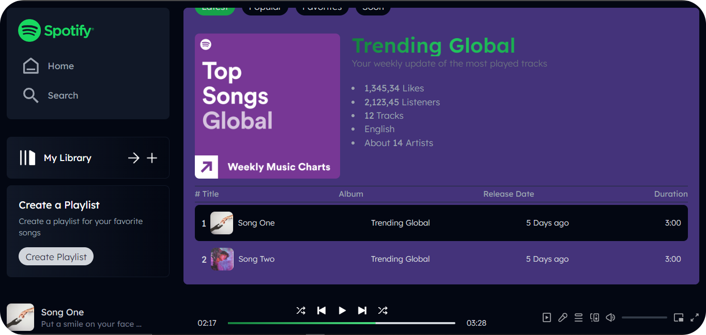

# 🎶 Spotify Clone with React.js & Tailwind CSS

A feature-rich Spotify clone built using React.js and Tailwind CSS, providing a seamless music experience with album discovery, music playback controls, playlists, and more.


## Details

This Spotify clone aims to replicate some of the core functionalities of the Spotify web application, giving users the ability to search, play, and control music, as well as explore albums and playlists.

- **🎧 Playing & Controlling Music**
- Play/Pause: Ability to start and stop music playback.
- Seek Control: Navigate within the track by moving the seek bar.
- Volume Control: Adjust volume with an intuitive slider.
- Next/Previous Track: Skip to the next or previous track.

- **🎶 Discovering Albums & Artists**
-Browse Albums: Explore albums based on categories or genres.

- **🌈 User Interface & Navigation**
- Responsive Design: Tailored for different devices using Tailwind CSS.
- Smooth Navigation: Quick and easy navigation between pages.
- Dark Mode: Sleek, dark-themed UI for a modern look.

## Demo | Screenshots




## Usage

First, clone the project using the repositroy URL, then move to the client folder the use the [npm](https://www.npmjs.com/) to install necessary packages & dependencies.

```bash
npm install
```

Run the application using the following command:

```bash
npm run dev
```

After running the application, you can access the dashboard via the link provided in the console.

## 🔗 Links

[](https://akhatarmourad.github.io/portfolio/)
[](https://www.linkedin.com/in/akhatarmourad/)